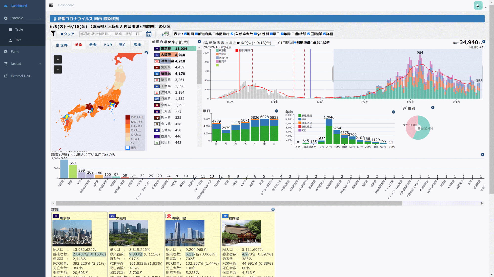

# covid19-dc-vue-admin

[`🇯🇵日本語`](./README.md) | [`🇺🇸English`] | [`🇨🇳中文`](./README.zh.md)

On the dashboard of the management screen interface [vue-element-admin](https://github.com/PanJiaChen/vue-admin-template), [New Coronavirus Infected Person Status Multidimensional Chart](https://github.com/yoshinaga-ken/covid19-dc) implemented.

A minimal vue admin template with Element UI & axios & iconfont & permission control & lint.



[Live demo](https://yoshinaga-ken.github.io/covid19-dc-vue-admin/)

## Project setup

```bash
# install dependency
npm install
```

## Compiles and hot-reloads for development
```
npm run dev
```

This will automatically open http://localhost:9528

## Build

```bash
# build for test environment
npm run build:stage

# build for production environment
npm run build:prod
```

## Advanced

```bash
# preview the release environment effect
npm run preview

# preview the release environment effect + static resource analysis
npm run preview -- --report

# code format check
npm run lint

# code format check and auto fix
npm run lint -- --fix
```

Refer to [Documentation](https://panjiachen.github.io/vue-element-admin-site/guide/essentials/deploy.html) for more information


## Extra

If you want router permission && generate menu by user roles , you can use this branch [permission-control](https://github.com/PanJiaChen/vue-admin-template/tree/permission-control)

For `typescript` version, you can use [vue-typescript-admin-template](https://github.com/Armour/vue-typescript-admin-template) (Credits: [@Armour](https://github.com/Armour))

## Related Project

- [vue-element-admin](https://github.com/PanJiaChen/vue-element-admin)

- [electron-vue-admin](https://github.com/PanJiaChen/electron-vue-admin)

- [vue-typescript-admin-template](https://github.com/Armour/vue-typescript-admin-template)

- [awesome-project](https://github.com/PanJiaChen/vue-element-admin/issues/2312)

