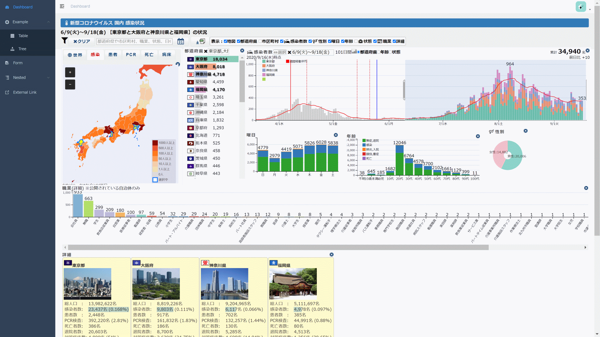

# covid19-dc-vue-admin

`🇯🇵日本語` (./README.md) | [`🇺🇸English`](./README.en.md) | [`🇨🇳中文`]

在管理屏幕界面[vue-element-admin](https://github.com/PanJiaChen/vue-admin-template)的仪表板上，[新的Corona病毒感染者状态多维图表](https://github.com/yoshinaga-ken/covid19-dc)已实现。

这是一个极简的 vue admin 管理后台。它只包含了 Element UI & axios & iconfont & permission control & lint，这些搭建后台必要的东西。



[Live demo](https://yoshinaga-ken.github.io/covid19-dc-vue-admin/dist/index.html)

## Project setup

```bash
# 安装依赖
npm install
```

## Compiles and hot-reloads for development
```
# 启动服务
npm run dev
```

浏览器访问 [http://localhost:9528](http://localhost:9528)

## 发布

```bash
# 构建测试环境
npm run build:stage

# 构建生产环境
npm run build:prod
```

## 其它

```bash
# 预览发布环境效果
npm run preview

# 预览发布环境效果 + 静态资源分析
npm run preview -- --report

# 代码格式检查
npm run lint

# 代码格式检查并自动修复
npm run lint -- --fix
```

更多信息请参考 [使用文档](https://panjiachen.github.io/vue-element-admin-site/zh/)

## 购买贴纸

你也可以通过 购买[官方授权的贴纸](https://smallsticker.com/product/vue-element-admin) 的方式来支持 vue-element-admin - 每售出一张贴纸，我们将获得 2 元的捐赠。

